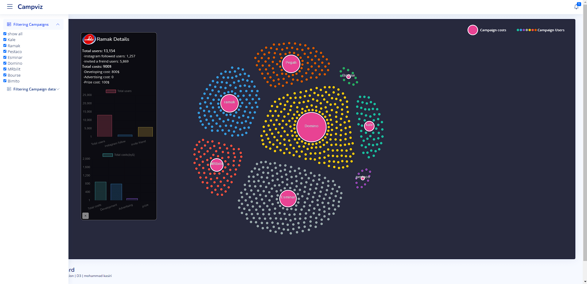

# WELCOME TO ADVER-GAME DATA-VISUALIZATION PROJECT
**A web-application interactive datavisualization system created by javascript libraries including D3.js version3, nodeJS and Jquery.js **
# Description
In this visualization for advergame campaigns data, we have visualized the data of 50,000 advergame users. Our efforts have been focused on the optimal use of visual elements and information visualization channels. The system has designed so that those who work with, would be able to interact. At the same time, we tried to design an attractive and engaging system, so that anyone has a pleasing experience by working with. We have made it possible for users to notice the effectiveness of advertising games, and be able to identify large campaigns, and factors affecting high-yield campaigns in the shortest time. Accordingly, those who work on Adver-games posses the ablity to compare the results obtained from these campaigns with eachother. Considering these data, they will gain a more profound insight into the Adver-games mechanism , so they can make a wiser, and more efficent decision regarding their subsequent advertising campains. 
All of our data have gathered from "[adrogame.com](https://adrogame.com/)" 
# How to run: 
**Make Environment Ready By Following Steps Below:** 
1- Install [nodejs](https://nodejs.org) on your computer 
2- Open your Terminal 
3- Within the Root directory of the project, Enter `npm start`, and then press Return 
4- Open your Browser, and in the URL type: `localhost:3000` 
5- Press Start Button, and you can work with data visualization  

 

